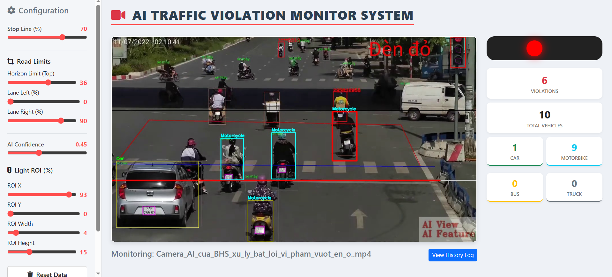
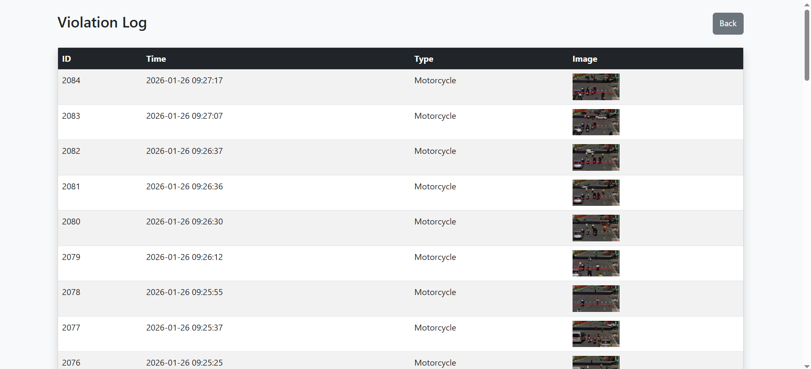
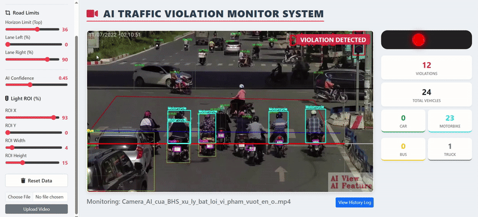

# 🚦 AI Traffic Violation Monitor System


AI Traffic Violation Monitor System is a real-time computer vision application for detecting **red light violations** from traffic videos. The system features **Automatic License Plate Recognition (ALPR)**, providing an interactive dashboard that allows users to tune detection parameters, observe results, and view zoomed-in license plate evidence instantly.

---

## 🖥️ System Interface

<div align="center">
  
  
  <br><br>
  
</div>
The dashboard includes:

* **Left panel:** Detection and configuration controls (Stop line, AI confidence, Traffic ROI, Road Limits).
* **Center:** Processed video stream with real-time bounding boxes and violation highlights.
* **Right panel:** Real-time traffic statistics (Vehicle counts by type) & **Live Plate Zoom** flash.

---

## 🚀 Main Features

### 🎯 Vehicle Detection & Robust Counting
* YOLOv8-based detection with persistent tracking.
* **Smart Counting Logic:** Combines object IDs with position-based fallbacks to ensure accurate vehicle counting even when tracking is temporarily lost.
* Supported vehicle classes: **Car, Motorcycle, Bus, Truck**.

### 🚦 Red Light Violation Detection
A violation is recorded when:
* The traffic light state is **RED** (detected via customizable ROI).
* A detected vehicle crosses the **Stop Line** while moving in the configured direction.

### 🔍 2-Stage License Plate Zoom (ALPR)
* **Stage 1:** Detects the violating vehicle using the primary traffic model.
* **Stage 2:** Crops the vehicle and passes it to a specialized secondary YOLOv8 model (`yolov8n-plate.pt`) to locate the license plate.
* **High-Res Zoom:** Crops the plate area and applies **3x Inter-Cubic Scaling** for maximum clarity.
* **Real-time Flash:** The zoomed plate is flashed on the dashboard immediately upon violation.

### 🛣️ Advanced Road Geometry Configuration
* **Traffic Direction:** Toggle between **UP** and **DOWN** flow directions.
* **Enforcement Zone (Lane Limits):** Define `Lane Left (%)`, `Lane Right (%)`, and `Horizon Limit (Top)` to restrict detection to specific lanes and ignore background traffic.
* **Stop Line Precision:** Vertically adjustable stop line for different camera angles.

### 🧠 Traffic Light Stabilization
* Uses an 8-frame buffer to stabilize red/green state detection.
* Reduces false triggers caused by light flickering or temporary obstructions.

### 📸 Violation Evidence & History
* **Database Storage:** All violations are logged in an **SQLite** database (`traffic.db`).
* **Evidence Capture:** Saves full-frame violation screenshots and cropped plate zooms.
* **History Log:** Dedicated page to review past violations with time-stamped evidence.

---

## 🎛️ Dashboard Controls

| Parameter | Description |
| --- | --- |
| **Stop Line (%)** | Vertical position of the enforcement line. |
| **Direction** | Direction of vehicle travel (UP or DOWN). |
| **AI Confidence** | Minimum threshold for YOLO detections. |
| **Traffic Light ROI** | X/Y/W/H coordinates to monitor the signal lamp. |
| **Lane Limits** | Horizontal boundaries (Left/Right) for the active road area. |
| **Horizon Limit** | Vertical boundary; ignore everything "above" this line. |

---

## 🛠️ Technology Stack

| Component | Technology |
| --- | --- |
| **AI Engine** | **Dual YOLOv8 Models** (General Traffic + Specialized Plate Detection) |
| **Video Processing** | OpenCV |
| **Backend** | Flask + **Eventlet** (Asynchronous processing) |
| **Real-time Comms** | **Flask-SocketIO** (Bidirectional UI updates) |
| **Frontend** | HTML5, CSS3, JavaScript (Bootstrap 5) |
| **Database** | SQLite |
| **Deployment** | Docker & Docker Compose |

---

## ⚙️ Installation & Usage

### Method 1: Docker (Recommended)

```bash
git clone https://github.com/hieu-web/traffic-monitor.git
cd traffic-monitor
docker-compose up --build
```

Open in browser:
```
http://localhost:5002
```

---

### Method 2: Local Installation

1. **Install Dependencies:**
   ```bash
   pip install -r requirements.txt
   ```
2. **Run Application:**
   ```bash
   python app.py
   ```
3. **Access Dashboard:**
   Open `http://localhost:5002` in your browser.

---

## 📂 Project Structure

```text
traffic-monitor/
├── models/              # YOLOv8 weights (best.pt, yolov8n-plate.pt)
├── static/
│   ├── uploads/         # Uploaded video storage
│   ├── evidence/        # Violation & Plate images
│   └── style.css        # Dashboard styling
├── templates/
│   ├── index.html       # Main dashboard UI
│   └── history.html     # Violation log viewer
├── app.py               # Flask/SocketIO Server
├── traffic_core.py      # Vision processing & Violation logic
├── traffic.db           # SQLite database
├── Dockerfile
├── docker-compose.yml
└── requirements.txt
```


